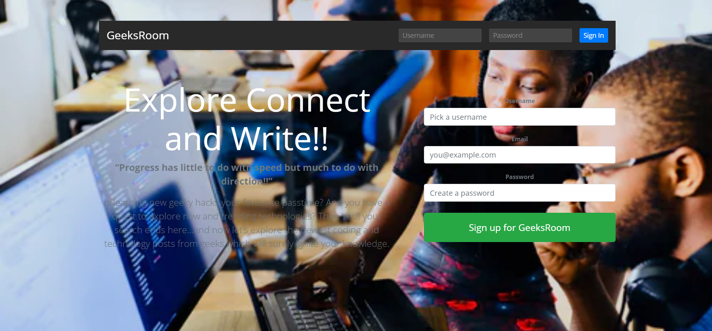
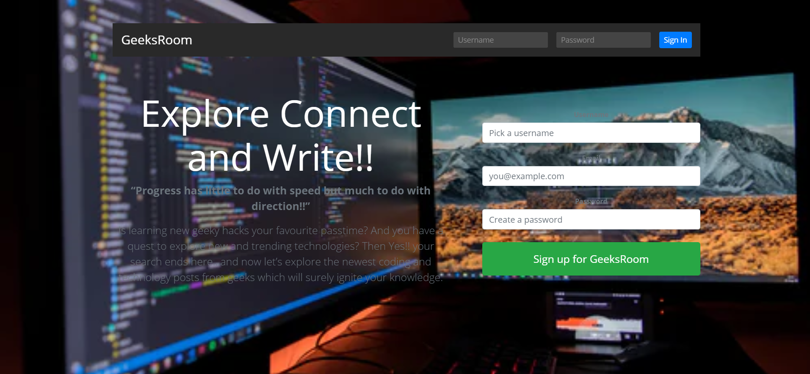
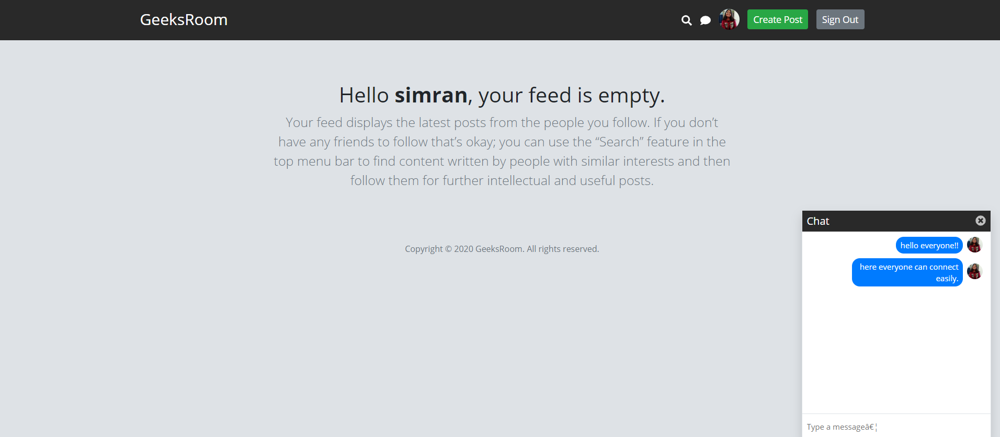
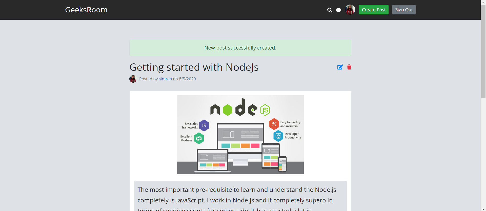
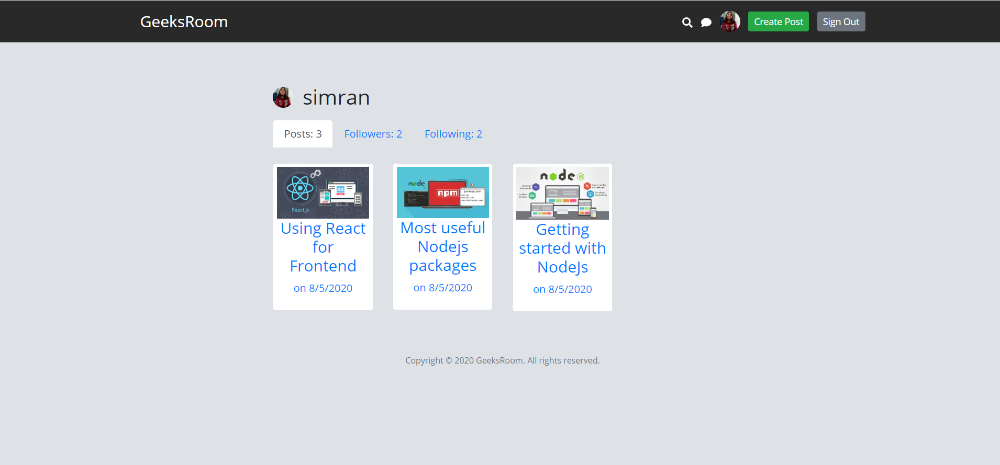
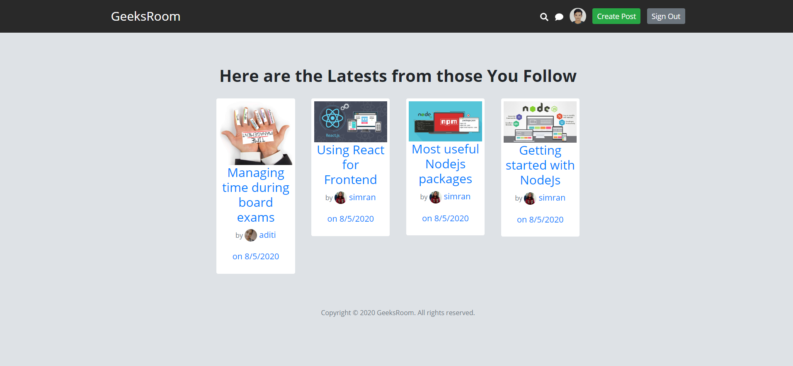
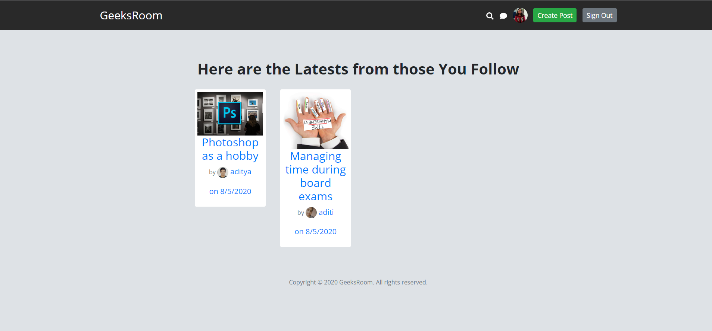
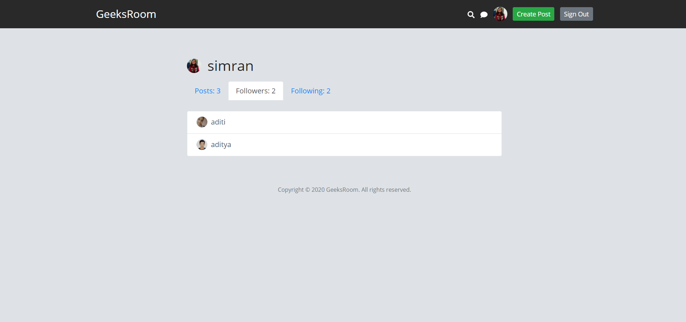

# The GeeksRoom

## An interactive forum for all the geeks Out there!!

&nbsp;&nbsp;&nbsp;

&nbsp;&nbsp;&nbsp;

The **geeksroom** is a **Userfriendly** and super convinient and **secure** platform where all levels are welcomed for learning new technologies and other geeky hacks along  with sharing their knowledge and experiences with others.Follow those who post about topics of your intrest and get to interact with them directly to explore more about new things and improve over time.

GeeksRoom is an **end-to-end secure website**. It is a **full-stack**, responsive, user-friendly and dynamic project based on **REST API(CRUD operations)** and designed using **NodeJs(Express)** for backend and HTML, CSS, and Bootsrap for frontend.The **MongoDB ATLAS** was used for the database requirements whereas **Heroku** was used for deployment.Emails are send to the new signUps and when new Post is created using sendgrid. 

&nbsp;&nbsp;&nbsp;

&nbsp;&nbsp;&nbsp;

The user can make their account using their emailId or **gravatar Id** and explore the whole new world of knowledge by simply searching their areas of interests and following the other users from whom they want to learn for being automatically updated with the new posts from whom they follow.
Users are also facilitated to directly interact with other users through real time chating. And to explore more about the **GEEKSROOM** go and check it out!! at **https://geeksroom.herokuapp.com/**

